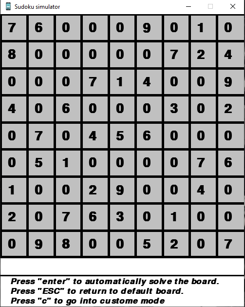

## Personal project

## Description
All the projects that I had fun building are listed here

## Project list:
* Sudoku game
* Shopping line simulator


## Sudoku game

#### Introduction
Sudoku is a famous Japanese puzzle solving game where numbers are to be filled into a 9 by 9 grid of squres that are subdivided into 3 by 3 boxes so that every row, every column, and every box contains the numbers 1 through 9.

#### Technologies I used
* Python for the language
* Pygame for the Graphical User Interface
* Backtracking algorithm for board solving

#### Installation
Use the package manager [pip](https://pip.pypa.io/en/stable/) to install [pygame](https://www.pygame.org/docs/)

```bash
pip install pygame
```
or
```bash
py -m pip install -U pygame --user
```
#### Basic Instruction
Press 'Enter' to automatically solve the board
Press 'ESC' to load default board
Press 'c' to go into custom mode and make your own board



##
##
## Shopping line simulator

#### Introduction
In this project I am building a program that will simulate the shopping checkout line where customers with different amount of items come at different time and try to finish checkout as soon as possible, the goal is to allocate customers to the most efficient shopping line.

#### Technologies I used
* C for the language
* Dynamic Queue for the Data Structure
* C String manipulation for managing input information of customers

#### 
