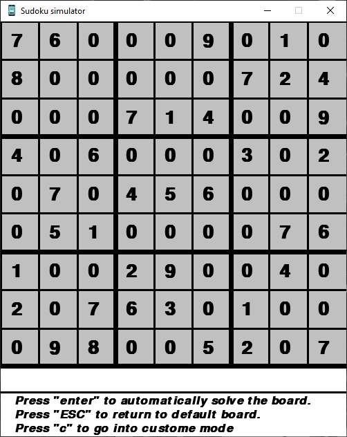
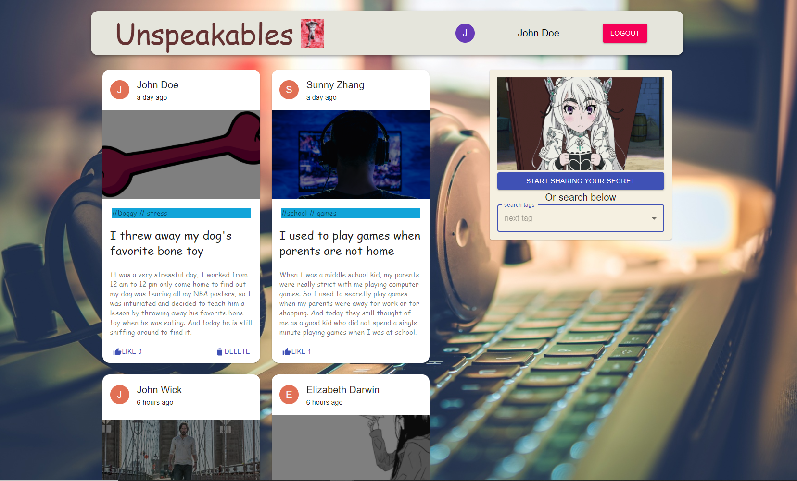

## Personal project

## Description
All the projects that I had fun building are listed here

## Project list:
* Multithreaded Web Server
* Sudoku Simulator
* Shopping line simulator
* Mern full stack website: Unspeakables


## Multithreaded Web Server

### Introduction
In this project I am building a program that simulates the behavior of a basic http web server with multithreading functionality and logging ability, the server can process requests such as GET, PUT, and HEAD from different connections all at once, and is able to log the requests as it completes them so that the user can check and verify later on. The default thread usage is 4.

### Technologies I used
* C for the language
* Dynamic Queue for the Data Structure
* Pthread library for Multithreading
* Mutex locks and Conditional Variables for mutual exclusion
* Socket programming
* Getopt for arguments parsing

### Prerequisite
* Linux [Ubuntu 20.04](https://ubuntu.com/download/desktop) environment
* Clang compiler for C
```bash
sudo apt install build-essential clang git make valgrind lldb clang-format
```

### Basic Instruction
##### Open a terminal and go to the directory where you place all the files for this project
##### Then enter the following in the terminal
```bash
make
./httpserver 8080 -N 3 -l logfile.txt
```
##### After that, a file named "logfile.txt" will be made for the server to log the requests, the server port will be set to 8080 with a thread usage of 3.
#####
##### To send requests to the server, open another terminal, use curl commands such as the following example:
* curl -T input http://localhost:8080/0123456789abcde -v
###### ---This will generate a PUT request to destination file "0123456789abcde" using the contents of the file "input"
* curl http://localhost:8080/0123456789abcde -v -o output
###### ---This will generate a GET request to destination file "0123456789abcde" and store the content to file "output"
* curl -T input http://localhost:8080/0123456789abcde -v
###### ---This will generate a HEAD request to destination file "0123456789abcde" and get back the file size
#####
##### To send multiple requests from different connections, use a test.sh script with content such as following:
###### curl localhost:8080/test0file012345 &
###### curl localhost:8080/0123456789abdec \
######     localhost:8080/abc123456789abc -I &
###### curl localhost:8080/1234 &
###### curl 127.0.0.1:8080/abcdde012345678 -T test.sh &
##### And enter the following in terminal
```bash
bash test.sh
```
#####
##### After done with the program, use control c to terminate the program.
##

## Sudoku game

### Introduction
Sudoku is a famous Japanese puzzle solving game where numbers are to be filled into a 9 by 9 grid of squres that are subdivided into 3 by 3 boxes so that every row, every column, and every box contains the numbers 1 through 9.

### Technologies I used
* Python for the language
* Pygame for the Graphical User Interface
* Backtracking algorithm for board solving

### Installation
Use the package manager [pip](https://pip.pypa.io/en/stable/) to install [pygame](https://www.pygame.org/docs/)

```bash
pip install pygame
```
or
```bash
py -m pip install -U pygame --user
```
### Basic Instruction
##### Press 'Enter' to automatically solve the board
##### Press 'ESC' to load default board
##### Press 'c' to go into custom mode and make your own board



##
## Shopping line simulator

### Introduction
In this project I am building a program that will simulate the shopping checkout line where customers with different amount of items come at different time and try to finish checkout as soon as possible, the goal is to allocate customers to the most efficient shopping line.

### Technologies I used
* C for the language
* Dynamic Queue for the Data Structure
* I/O Stream for managing input information of customers and output on files

### Basic Instruction
##### Open a terminal and go to the directory where you place all the files for this project
##### You can modify the numbers in the input file to test out different result
##### The format of the input will be as follow:
##### Number_of_customers
##### arrival_time_1 duration_time_1(latency)
##### arrival_time_2 duration_time_2
##### arrival_time_3 duration_time_3
##### ...
##### 
##### Then enter the following in terminal
```bash
make
./Simulation input output
```
##### After that, 2 output files will be made showcasing the result.
##

## Mern full stack website: [Unspeakables](https://unspeakables.netlify.app/)



### Introduction
In this project I built a full stack website using Mongodb, Expressjs, Reactjs, and Nodejs with CRUD APIs and user authentication functionality that also allows google login.
The website name is Unspeakables, it is a platform where people can come and share their secrets with everyone. What's more, users can choose what kinds of secrets they want
to see using the search bar to select tags that interest them. Each secret post will show the owner of the post, how long it has been posted, a picture of choice from the poster, tags,
title, secret content, and like counts. And of course, only the owner of the secret post can delete their post, the users can click the like button to increase the like counts of a post, and if they click again, it will redo the like action and decrease like counts.

### Technologies I used
* Javascript
* HTML/CSS
* Reactjs for the frontend
* Nodejs and Expressjs for the backend
* Mongodb for the NoSQL database
* JSON Web Token, bcryptjs, and GoogleLogin for user authentication
* Material UI for the user interfaces
* Create-react-app as starting point
* Netlify for frontend deployment
* Heroku for backend deployment

### Prerequisite (for local development)
* [Node.js](https://nodejs.org/en/download/)
* Mongodb Atlas

### Basic Instruction
##### This project is currently deployed and you can click [here](https://unspeakables.netlify.app/) to go to the deployed site.
##### The following is for local development purpose
###### Clone/download the project folder in your local machine
###### Go to the server folder, open .env using the editor of your choice
###### Enter your Mongodb Atlas connection url in to the CONNECTION_URL variable
###### Go back to the project folder
###### Open two terminal
###### In terminal 1, do the following
```bash
cd client
npm install
```
###### In terminal 2, do the following
```bash
cd server
npm install
```
###### wait until the packages are installed in both side
###### Then in both terminals
```bash
npm start
```
###### And the website would automatically open in your web browser

### Credits:
* background image src: https://curiosityhuman.com/how-to-find-good-background-music-for-your-videos/
* icon image src: https://unsplash.com/photos/dzBtQJavGNw
* anime question pic src: https://blog.sakugabooru.com/2017/01/18/sakuqa-anime-industry-and-production-questions-2/
* Anime nodding pic src: https://knowyourmeme.com/photos/892427-anime-manga
* favicon src: https://icons8.com/icon/122769/notre-dame
* UI design is inspired by [Javascript Mastery](https://www.youtube.com/channel/UCmXmlB4-HJytD7wek0Uo97A)
